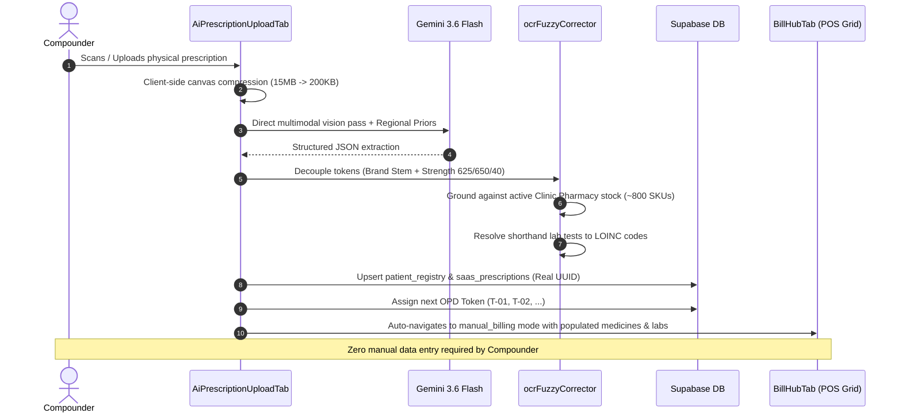

# 🏛️ CLINIC OS IMMUTABLE ARCHITECTURAL VAULT & MASTER BLUEPRINT
## VitalSync Mediflow — Core USP Sovereign System Architecture

> [!CAUTION]
> **IMMUTABLE CORE BLUEPRINT — ZERO AUTONOMOUS MODIFICATION ALLOWED**
> This file is the permanent architectural ground truth for the **VitalSync Clinic OS**, the primary Core USP of Mediflow.
> Any AI agent operating on this repository is strictly forbidden from refactoring, altering, bypassing, or deleting the operational loops, data flows, and invariants detailed below without the explicit override command: `"OVERRIDE CLINIC OS FORTRESS SHIELD"`.

---

## 🧭 Executive Architecture & System Purpose
**VitalSync Clinic OS** is an autonomous outpatient operating system designed specifically for independent medical practitioners, polyclinics, nursing homes, and local pharmacies in Tier 2 and Tier 3 Indian healthcare ecosystems (e.g., Purnea, Bihar).

It replaces fragmented manual registers, clunky enterprise EMRs, and delayed diagnostic loops with a **sub-300ms, real-time, zero-data-entry clinical operating network** anchored on WhatsApp and Postgres Change Data Capture (CDC).

---

## 🛡️ The 5 Inviolate Clinic OS Manifestos (Rule Zero)
1. **Zero-Data-Entry Doctrine**: The OS operates autonomously. Doctors and Compounders are never forced to do repetitive manual data entry. AI (Eagle-Eye RAG OCR, Ambient Audio Scribe) and IoT telemetry capture clinical data at the source.
2. **Realtime CDC Engine Integrity**: All consoles synchronize via `supabase_realtime` and Postgres CDC debounced at `250ms`. Polling intervals (`setInterval`) and manual page refreshes are strictly banned.
3. **1-Tap WhatsApp Protocol**: The patient-facing interface is WhatsApp. Patients are never forced to download mobile apps or navigate complex web portals. Communication uses native interactive reply buttons (`type: "button"`).
4. **Smart Queue Inviolability**: The operational loop (Compounder $\to$ Lab $\to$ Doctor) must never be broken. Pathology reports flow into the Compounder's review queue before reaching the patient. Unpaid appointments must never enter active clinical queues.
5. **No Technical Jargon**: End-users are non-technical healthcare staff. Raw error codes, JSON objects, or developer menus are strictly hidden behind self-healing systems and friendly "Clinic Action Required" notices.

---

## 🔒 The 15 Protected Clinic OS Core Subsystems

| Subsystem Domain | Primary File | Key Functions & Invariants |
| :--- | :--- | :--- |
| **Compounder OCR** | `frontend/src/components/compounder/tabs/AiPrescriptionUploadTab.tsx` | Autonomous paper upload, canvas compression, zero-data-entry loop, and automatic POS navigation. |
| **OCR Fuzzy Corrector** | `frontend/src/utils/ocrFuzzyCorrector.ts` | Token decoupler (`splitDrugNameAndStrength`), `STRENGTH_SIGNATURES`, Tier 1 clinic stock grounding, Levenshtein matching. |
| **Paper Mode Service** | `frontend/src/services/paperModeService.ts` | Permanent `PAPER_MODE_WELCOME_TEMPLATE` (frozen), patient profile synthesis, and WhatsApp PDF dispatch. |
| **Compounder Desk** | `frontend/src/components/compounder/CompounderDashboard.tsx` | Rapid OPD token assignment (`T-01`), Vitals entry (BP, Pulse, SpO2, Sugar, BMI formula), Eye Dilation timer. |
| **POS & BillHub** | `frontend/src/components/compounder/tabs/BillHubTab.tsx` | 1-Tap POS billing, direct UPI QR generation, cash counter payments, and receipt printing. |
| **Doctor EMR Console** | `frontend/src/components/doctor/DoctorDashboard.tsx` | Consultation queue, role-switching transitions, sovereign pod hydration, and WABA telemetry. |
| **EMR Consultation Tab**| `frontend/src/components/doctor/tabs/ConsultationTab.tsx` | Live queue ordering, bilateral ophthalmic refraction grid, 1-0-1 prescription builder, and lab ordering. |
| **Encounter Service** | `frontend/src/services/encounterService.ts` | Clinical encounter creation, legacy prescription synthesis, and SOAP note persistence. |
| **Queue Pipeline** | `frontend/src/services/appointmentPipeline.ts` | Emergency SOS / VIP Priority #1 routing (`isVipBooking`), Payment Clearance Gate (`isPendingPayment`). |
| **Pharmacy Counter** | `frontend/src/components/pharmacy/PharmacyDashboard.tsx` | Dispensing queue, low-stock alerts, fast dispensation checkout. |
| **Pharmacy Service** | `frontend/src/services/pharmacyService.ts` | FEFO batch inventory tracking (`BATCH-2026-X1`), 1-Click Refill Delivery (Day 7, Month 1, Month 3 reminders). |
| **Pathology Worklist** | `frontend/src/components/lab/LabDashboard.tsx` | LOINC test worklist, barcode tracking (`BAR-XXXX`), signed PDF report upload. |
| **Lab Service** | `frontend/src/services/labService.ts` | LOINC catalog (`4544-3` HbA1c, `2160-0` Creatinine), report approval deferred to Compounder evening review. |
| **Patient Service** | `frontend/src/services/patientService.ts` | Deterministic token generator (`generateNextTokenNumber`), dual-write Supabase persistence with WAL fallback. |
| **Billing Service** | `frontend/src/services/billingService.ts` | Doctor Fee Immunity Protocol (0% platform fee), Ledger splits (1% Pharmacy, 2% Lab), commission pool safety buffer. |

---

## 🔄 The 5 Master Operational Loops (Detailed Blueprints)

### 🔁 LOOP 1: Autonomous Prescription OCR Ingestion & Walk-In Intake

### 🔁 LOOP 2: Doctor EMR Consultation & Clinical Intelligence
1. **Queue Hydration**: Live consultation queue sorts patients deterministically:
   - **Emergency SOS / VIP Bookings**: Placed at Priority #1 position with a pulsing red banner.
   - **Payment Clearance Gate**: Appointments with status `pending_payment` are strictly quarantined from the active queue until cleared.
2. **Consultation Flow**:
   - **CDSS Ambient Scribe**: Listens to consultation audio or receives clinical notes; Groq Llama-3 70B & Gemini Flash auto-populate diagnosis and Rx.
   - **Ophthalmic Refraction Grid**: Bilateral entry (Right Eye / Left Eye: Sph, Cyl, Axis, Visual Acuity, IOP, Fundus) persists to `saas_prescriptions.refraction`.
   - **Digital Prescriptions**: Normalized to Indian notation (`1-0-1`, `1-0-0`, `0-0-1`, `SOS`) with duration and food instructions (`AC`, `PC`).
3. **Doctor Consultation Fee Immunity Protocol**:
   - Flat Doctor fee (e.g. ₹500.00) goes 100% to the Doctor.
   - **0% Platform Fee** and **0 pool deduction** applied to doctor consultation fees.

### 🔁 LOOP 3: Pharmacy POS & FEFO Dispensing Counter
1. **FEFO Inventory Allocation**:
   - Every medicine SKU is linked to a batch identifier (`BATCH-2026-X1`) and expiration date.
   - Earliest-expiring batches are automatically prioritized for dispensation.
2. **1-Tap POS Checkout**:
   - Prescribed medications populate the checkout cart with active batch numbers and GST rates (5% or 12%).
   - Compounder / Pharmacist confirms dispensation in 1 tap, automatically reducing inventory.
3. **Chronic Care 1-Click Delivery & Reminders**:
   - Chronic patients (Diabetes, Hypertension, Thyroid) are enrolled into `chronic_care_cohorts`.
   - Refill delivery reminders are autonomously scheduled on **Day 7**, **Month 1**, and **Month 3**.
4. **Platform Fee Split**:
   - A 1% Pharmacy Platform Fee is logged to `financial_ledgers` and credited to the clinic's commission pool.

### 🔁 LOOP 4: Pathology Lab Worklist & 2-Touchpoint Care Loop
1. **Touchpoint 1 (Requisition & Sampling)**:
   - Doctor prescribes diagnostic investigations with LOINC codes (`4544-3` HbA1c, `2160-0` Creatinine, `58410-2` CBC).
   - Requisition enters the Pathology Worklist with a deterministic barcode (`MED-LOINC-ID`).
   - Phlebotomist verifies sample collection.
2. **Report Upload & Deferral Protocol**:
   - Pathologist uploads the signed electronic PDF report.
   - System updates report status to `pending` in the patient profile.
   - **Direct patient dispatch is deferred**: Report appears in the Compounder's *"Lab Reports Arrived & Evening Review"* widget.
3. **Touchpoint 2 (Evening Physical Review)**:
   - Compounder clicks *"Assign Slot"* and selects an evening time (e.g. 04:00 PM – 06:00 PM).
   - Autonomous WhatsApp dispatch notifies the patient to physically visit the clinic for review.

### 🔁 LOOP 5: Real-Time CDC Data Contract & Offline Resilience
1. **250ms CDC Stream Debounce**:
   - All Supabase Postgres CDC subscriptions (`RealtimeSyncService.subscribeToLiveClinicUpdates`) debounce incoming mutations at 250ms.
   - Guarantees sub-300ms cross-console updates while preventing React render thrashing.
2. **Defensive Field Normalization**:
   - Bidirectional mapping between database `snake_case` (`patient_id`, `doctor_id`, `token_number`) and application `camelCase` (`patientId`, `doctorId`, `tokenNumber`).
3. **Offline WAL Outbox Resilience**:
   - If internet connectivity drops, writes are held in IndexedDB (`vitalsync_wal_outbox`).
   - Upon reconnection, mutations replay deterministically using immutable UUID idempotency keys.

---

## 🚫 Absolute Prohibitions for Future AI Agents
1. **NEVER modify or refactor** any of the 15 protected Clinic OS files without explicit user command: `"OVERRIDE CLINIC OS FORTRESS SHIELD"`.
2. **NEVER use `useEffect`** to spawn modals autonomously (Zero-Data-Entry rule).
3. **NEVER replace Postgres CDC streams** with manual `setInterval` polling or page reloads.
4. **NEVER bypass the Payment Clearance Gate** for unpaid appointments.
5. **NEVER show raw technical errors or JSON** to clinical end-users.
