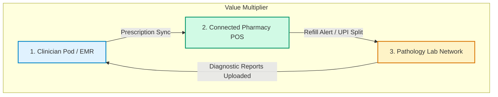
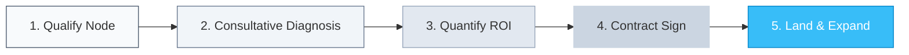

# Mediflow Care — B2B SaaS Sales Playbook & MBA Masterclass
### Strategic GTM Framework for Clinic Networks, Pharmacies, and Pathology Labs

---

## 1. Executive Summary & The Unified Care Loop

Mediflow Care is a multi-tenant clinical software suite that bridges the gap between independent healthcare entities: **Clinic Networks**, **Pharmacies**, and **Pathology Labs**. Historically, B2B digital health sales have failed because they sell fragmented, single-point solutions (e.g., standalone EMRs or separate pharmacy POS systems). 

Mediflow's core sales thesis is **The Unified Care Loop**. By binding these three pillars, we create a patient-retention flywheel that drives revenue and clinical compliance.



### The Flywheel Value Proposition
1. **Clinicians** get automated RAG-scribe consultation notes and diagnostic summaries injected straight into patient history.
2. **Pharmacies** receive dynamic prescription routing directly to their custom POS, reducing dispense time by 60% and enabling automated chronic refill campaigns.
3. **Labs** get immediate pathology requisitions with secure report PDF uploads directly to the clinician's viewport, cutting patient turnaround time in half.

---

## 2. Ideal Customer Profile (ICP) & Persona Matrix

To execute enterprise and mid-market sales, representatives must identify the correct buyer persona and speak their specific business language.

| Persona | Core Pain Points | Core Business Motivator (Value) | Codebase Feature Alignment |
| :--- | :--- | :--- | :--- |
| **Clinician / Clinic Network Director** | Documentation overhead, patient leakage to external pharmacies/labs, compliance worries. | Consultation throughput, clinical accuracy, patient retention. | [WhatsApp RAG Chatbot](file:///c:/Users/vivek/OneDrive/Desktop/Mediflow%20ecosystem/meta_business_manager_guide.md), Clinical Refraction Charts, WhatsApp vitals dispatch. |
| **Pharmacy Owner / Pharmacy Manager** | Manual entry errors, lack of inventory forecasting, slow checkout, high drop-off for chronic medicine refills. | GMV (Gross Merchandise Value), average order value, inventory turnover rate. | POS Billing Engine, Seasonal Inventory Forecasting Widget, [pharmacyService.ts Platform Split](file:///c:/Users/vivek/OneDrive/Desktop/Mediflow%20ecosystem/frontend/src/services/pharmacyService.ts#L690). |
| **Pathology Lab Owner** | Paper requisition delays, delayed invoice settlements, lack of direct doctor integration. | Diagnostic order volume, settlement speed, test menu utilization. | PDF report scanner, lab requisition dashboard, automated invoice routing. |
| **SaaS Administrator / Executive Director** | Security compliance (HIPAA), multi-tenant bank onboarding, system performance. | Scaling pod health, compliance, transaction ledger auditing. | SaaS Command Center, [20260530000002_multi_tenant_bank_onboarding.sql](file:///c:/Users/vivek/OneDrive/Desktop/Mediflow%20ecosystem/supabase/migrations/20260530000002_multi_tenant_bank_onboarding.sql). |

---

## 3. The MBA B2B SaaS Sales Framework

We train our sales teams on a customized version of the **MEDDPICC / Consultative Selling** framework, specifically optimized for healthcare networks.



### 3.1 Step-by-Step GTM Funnel Mechanics

1. **Node Qualification**: Identify the anchor node in a local ecosystem. Usually, this is a Clinic Network with 3+ doctors. If you land the doctors, the local pharmacy and pathology labs will naturally onboarding to keep up with patient flows.
2. **Consultative Diagnosis (Spin Selling)**:
   - *Situation*: "How do you transmit prescriptions to local pharmacies or labs currently?"
   - *Problem*: "How often do patients lose paper slips or buy medicine from random stores outside your ecosystem?"
   - *Implication*: "This loss translates directly to a lack of follow-up compliance and at least 30% revenue leakage."
   - *Need-Payoff*: "If your EMR could automatically sync prescriptions to the pharmacist next door and send WhatsApp alerts to the patient on Day 25, how would that affect your retention rate?"
3. **Quantifying the Value Case (ROI Calculator)**:
   - **For Clinics**: 30% reduction in admin work via RAG-scribing = +2 patients seen per day. At a standard consultation fee, this yields a direct ROI within 1 month.
   - **For Pharmacies**: Upwards of 40% increase in chronic refill adherence due to auto-notifications on Day 25.
   - **For Labs**: Direct integration means they become the exclusive pathology referral partner for the clinic network.

---

## 4. Persona-Specific Pitch Playbooks

### 4.1 Pitching the Doctor (EMR & AI Scribe)
> **Pitch Script**:
> *"Doctor, you spent over four years in medical school to care for patients, not to type into EMR text fields. Mediflow integrates your EMR with an AI-RAG scribe and formats notes automatically. Furthermore, when you prescribe chronic medication, the system takes care of patient compliance. On Day 25, the patient gets a polite refill alert on WhatsApp, synced right to your partner pharmacy, and schedules their next follow-up appointment automatically. You capture clinical continuity; your partner pharmacy captures the sale; the patient gets continuous care."*

### 4.2 Pitching the Pharmacist (POS & Split Payments)
> **Pitch Script**:
> *"As a pharmacist, speed and accuracy are everything. When a patient walks out of the clinic upstairs, their prescription is already loaded onto your Mediflow POS terminal. No deciphering doctor handwriting, no manual inventory entry. Once you scan the patient barcode, the invoice is generated, and a single dynamic UPI QR code handles checkout. Even better, our backend securely handles platform splits automatically, routing the platform fee seamlessly and sending your revenue straight to your merchant account."*
> 
> *Developer Reference*: POS integration uses the split-routing logic configured in [pharmacyService.ts:L690](file:///c:/Users/vivek/OneDrive/Desktop/Mediflow%20ecosystem/frontend/src/services/pharmacyService.ts#L690) to process and route platform splits:
> ```typescript
> const splitPlat = 5; // Hardcoded platform fee split (5% for pharmacy sales)
> ```

### 4.3 Pitching the Pathology Lab (Direct Integration)
> **Pitch Script**:
> *"Lab owners face a major referral bottleneck. With Mediflow, your lab is directly in the doctor's EMR interface. When a doctor requests a CBC or Lipid panel, it routes straight to your dashboard. Once the blood draw is processed, you drop the report PDF into the portal, and the doctor gets it instantly. Fast turnaround leads to higher referral volumes, and we settle your invoice split immediately."*

---

## 5. Pricing & Revenue Architecture

Mediflow uses a hybrid model of **SaaS Subscriptions** and **Transactional Monetization** to align incentives with customer growth.

```
┌────────────────────────────────────────────────────────┐
│               Mediflow Care Revenue Stream             │
├───────────────────────────┬────────────────────────────┤
│       Fixed SaaS          │    Variable Transaction    │
│  (Clinician Subscriptions)│   (5% Pharmacy POS Split)  │
└───────────────────────────┴────────────────────────────┘
```

1. **Clinic Subscription (SaaS Seat)**:
   - **Standard Tier**: ₹1,999/month per doctor seat. Includes EMR, clinical charts, and compounder portals.
   - **Enterprise Tier**: Custom pricing for multi-clinic networks, including SaaS Command Center diagnostics and custom WABA integrations.
2. **Ecosystem Transaction Split**:
   - For all pharmacy sales processed through the integrated Mediflow POS, a **5% platform fee split** is automatically calculated.
   - *Developer Reference*: This split is defined in the POS logic in [pharmacyService.ts](file:///c:/Users/vivek/OneDrive/Desktop/Mediflow%20ecosystem/frontend/src/services/pharmacyService.ts#L690) and integrated with the [SettlementWidget.tsx](file:///c:/Users/vivek/OneDrive/Desktop/Mediflow%20ecosystem/frontend/src/components/shared/SettlementWidget.tsx) UI component.
3. **Multi-Tenant Bank Onboarding**:
   - Tenant payout details are registered and audited securely to route funds.
   - *Developer Reference*: This workflow is backed by the database schema defined in [20260530000002_multi_tenant_bank_onboarding.sql](file:///c:/Users/vivek/OneDrive/Desktop/Mediflow%20ecosystem/supabase/migrations/20260530000002_multi_tenant_bank_onboarding.sql).

---

## 6. Objections Handling Matrix

> [!WARNING]
> Healthcare providers are extremely risk-averse. Sales reps must handle objections using verified clinical and security policies.

### Objection 1: "How do I know my patient health records are secure?"
- **Response**: *"Mediflow is designed with enterprise-grade multi-tenancy. Every clinic's data is isolated at the database layer using Postgres Row Level Security (RLS) mapped to a unique `pod_id`. Clinicians and staff can only access data belonging to their specific pod. Additionally, patient metadata is encrypted, and all communications comply with local regulatory mandates (e.g., GDPR/HIPAA compliance)."*
- *Reference*: Security details can be found in the [brain.md](file:///c:/Users/vivek/OneDrive/Desktop/Mediflow%20ecosystem/brain.md#L52-L70) configuration file.

### Objection 2: "What happens if our internet connection goes offline?"
- **Response**: *"Our desktop Tauri client has local synchronization safeguards. Patient records are cached locally, allowing clinical check-ins, barcode scans, and POS checkouts to function offline. Once the connection is re-established, Mediflow merges the local state back to the Supabase cloud ledger securely."*

### Objection 3: "Why should I pay a 5% transaction split on pharmacy sales?"
- **Response**: *"The 5% split is only charged on sales driven directly through the Mediflow EMR-to-Pharmacy care loop. It covers the costs of WhatsApp Business API notifications, patient refill alerts, and automated POS syncs. Since the system increases patient chronic medication refill compliance by 40%, the net increase in pharmacy GMV far outweighs the split fee."*

---

## 7. GTM Checklist & Enablement Playbook

To launch Mediflow in a new territory, follow this 5-step checklist:

- [ ] **Ecosystem Mapping**: Map local clinic clusters within a 3-mile radius of target pharmacies and labs.
- [ ] **Anchor Clinic Acquisition**: Pitch and sign the primary clinic network first using standard SaaS subscription.
- [ ] **Partner Node Onboarding**: Pitch the local pharmacy and lab by showing they can capture direct referrals from the anchor clinic.
- [ ] **Bank Account Setup**: Onboard the pharmacy and lab merchant accounts using the secure bank onboarding wizard to activate transaction split routing.
- [ ] **Flywheel Activation**: Run training sessions for compounders, pharmacists, and lab techs to ensure high platform adoption.
