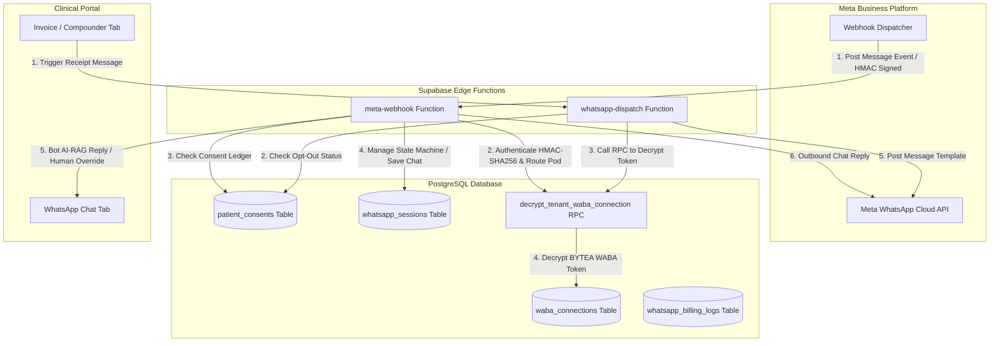

# Mediflow — Meta Business Manager & WABA Integration Guide
### Multi-Tenant WhatsApp Business API & AI-RAG Scribe Engineering Manual

---

## 1. System Overview & Architecture

Mediflow integrates with the **Meta Business Platform (WhatsApp Business API)** using a highly secure, multi-tenant architecture. The integration supports clinical workflows, transaction notifications (invoice receipts), and an interactive **AI-RAG Chatbot** for patient encounters, bookings, and medical record queries.

The architecture isolates clinical pods (tenants), secures WABA tokens using advanced pgp symmetric cryptography inside the database, and processes asynchronous webhooks securely via HMAC-SHA256 signature verification.



---

## 2. Meta Developer Portal Setup

To configure Mediflow’s live integration, the clinic group or tenant administrator must configure an App on the **Meta for Developers** portal.

### 2.1 Developer App Configuration
1. Go to the [Meta for Developers Portal](://develhttpsopers.facebook.com/).
2. Click **My Apps** -> **Create App**.
3. Choose **Other** -> **Business** (this allows access to WhatsApp Business API).
4. Fill in the App Name (e.g., `Mediflow Messaging Hub`) and link it to your **Meta Business Portfolio (Business Manager)**.

### 2.2 Adding WhatsApp to the App
1. In the App Dashboard, scroll to **Add products to your app**.
2. Click **Set up** next to **WhatsApp**.
3. Once loaded, click **Quickstart** or **API Setup** under the WhatsApp menu to view your temporary phone numbers, Test Phone Number IDs, and WABA IDs.

### 2.3 Generating a Permanent System User Token
By default, the developer portal gives you a 24-hour access token. For production environments, you must generate a **Permanent System User Token**:
1. Open your **Meta Business Suite / Business Settings** (`https://business.facebook.com/settings/`).
2. Go to **Users** -> **System Users**.
3. Create a new System User (assign the role **Admin**).
4. Click **Add Assets** and assign your Developer App to this System User with full control permission.
5. Click **Generate New Token**.
6. Select your App and check the following permissions:
   - `whatsapp_business_messaging` (CRITICAL for sending messages)
   - `whatsapp_business_management` (CRITICAL for managing templates and billing info)
7. Copy the token immediately and save it in a secure password manager.

> [!WARNING]
> Meta will never show this token to you again. If lost, you will need to generate a new token, encrypt it, and update the database record.

### 2.4 Webhook Handshake Configuration
In the Meta App Dashboard:
1. Go to **WhatsApp** -> **Configuration**.
2. Set the **Webhook URL** to your deployed Supabase Edge Function:
   `https://<your-project-ref>.supabase.co/functions/v1/meta-webhook`
3. Enter your secret **Verify Token** (e.g., `mediflow_handshake_secret`). This must match the `META_VERIFY_TOKEN` env variable.
4. Click **Verify and Save**.
5. Under **Webhook Fields**, click **Subscribe** to the `messages` event.

---

## 3. Database Schema & Token Encryption

Mediflow uses high-grade cryptography (`pgcrypto` standard envelope) to encrypt system user tokens for individual tenants (multi-tenancy) inside the PostgreSQL database.

### 3.1 SQL Schema Definitions
The tables are defined as follows:

```sql
-- 1. Enable pgcrypto inside PostgreSQL Extensions schema
CREATE EXTENSION IF NOT EXISTS pgcrypto WITH SCHEMA extensions;

-- 2. WABA Connections table (Multi-Tenant)
CREATE TABLE IF NOT EXISTS public.waba_connections (
    id UUID PRIMARY KEY DEFAULT gen_random_uuid(),
    pod_id UUID NOT NULL REFERENCES public.pods(id) ON DELETE CASCADE,
    entity_id UUID NOT NULL REFERENCES public.entities(id) ON DELETE CASCADE,
    phone_number_id VARCHAR(255) UNIQUE NOT NULL,
    waba_id VARCHAR(255) UNIQUE NOT NULL,
    phone_number VARCHAR(50) UNIQUE NOT NULL,
    encrypted_system_user_token BYTEA NOT NULL, -- Binary representation of encrypted token
    waba_status VARCHAR(50) DEFAULT 'pending',  -- 'pending', 'active', 'disconnected'
    verified_at TIMESTAMPTZ,
    created_at TIMESTAMPTZ DEFAULT NOW(),
    updated_at TIMESTAMPTZ DEFAULT NOW()
);

-- Index for instant lookup during webhook event routing
CREATE INDEX IF NOT EXISTS idx_waba_connections_phone_number_id ON public.waba_connections(phone_number_id);
```

### 3.2 Secure Token Encryption functions
Tokens must never be stored in plain text. Use these PL/pgSQL database functions:

```sql
-- Encrypts a text token using a symmetric secret key
CREATE OR REPLACE FUNCTION public.encrypt_waba_token(token TEXT, secret_key TEXT)
RETURNS BYTEA AS $$
BEGIN
    RETURN extensions.pgp_sym_encrypt(token, secret_key);
END;
$$ LANGUAGE plpgsql SECURITY DEFINER;

-- Decrypts a binary bytea token back to plain text
CREATE OR REPLACE FUNCTION public.decrypt_waba_token(encrypted_token BYTEA, secret_key TEXT)
RETURNS TEXT AS $$
BEGIN
    RETURN extensions.pgp_sym_decrypt(encrypted_token, secret_key);
END;
$$ LANGUAGE plpgsql SECURITY DEFINER;

-- High-performance routing helper executed in the security security-definer context
CREATE OR REPLACE FUNCTION public.decrypt_tenant_waba_connection(p_phone_number_id TEXT, p_secret_key TEXT)
RETURNS TABLE (
    pod_id UUID,
    entity_id UUID,
    decrypted_token TEXT
) AS $$
BEGIN
    RETURN QUERY
    SELECT 
        wc.pod_id,
        wc.entity_id,
        public.decrypt_waba_token(wc.encrypted_system_user_token, p_secret_key) AS decrypted_token
    FROM public.waba_connections wc
    WHERE wc.phone_number_id = p_phone_number_id;
END;
$$ LANGUAGE plpgsql SECURITY DEFINER;
```

---

## 4. Outbound Messaging Pipeline

Outbound communication is handled by the `whatsapp-dispatch` Edge Function. It is structured defensively with:
1. **Consent Validation**: Prevents messaging patients who opted out.
2. **Dynamic Decryption**: Queries the database using the secret key to obtain the plain WABA token.
3. **Template payload Construction**: Forwards formatted parameters to Meta Graph API.
4. **Simulator Fallback**: If the tenant hasn't configured a active WABA connection, it updates the visual dashboard simulator table `whatsapp_sessions` directly to maintain high UI responsiveness.

### 4.1 Dispatch Workflow Details
- **Base API Endpoint**: `https://graph.facebook.com/v21.0/${phoneId}/messages`
- **Method**: `POST`
- **Authorization**: `Bearer <decrypted_system_user_token>`

#### Payload Structure:
```json
{
  "messaging_product": "whatsapp",
  "recipient_type": "individual",
  "to": "+91XXXXXXXXXX",
  "type": "template",
  "template": {
    "name": "payment_receipt_template",
    "language": { "code": "en_US" },
    "components": [
      {
        "type": "body",
        "parameters": [
          { "type": "text", "text": "Patient Name" },
          { "type": "text", "text": "Amount Paid" }
        ]
      }
    ]
  }
}
```

> [!NOTE]
> Ensure all templates are pre-approved inside the **Meta Business Manager** portal. Attempting to dispatch an unapproved template will return an HTTP 400 error.

---

## 5. Inbound Webhook Pipeline & AI Chatbot

The `meta-webhook` edge function is the entry point for all real-time patient interactions. It processes incoming messages, parses text inputs, updates UI logs, and directs logic to the interactive AI-RAG chatbot state machine.

### 5.1 Signature Authentication (HMAC-SHA256)
To secure the webhook from malicious third parties, signature verification MUST be enabled in production. When `META_APP_SECRET` is configured in your environment, the webhook computes a SHA-256 HMAC hash of the raw request payload using the App Secret and verifies it against Meta's `x-hub-signature-256` header:

```typescript
const signature256 = req.headers.get("x-hub-signature-256");
const appSecret = Deno.env.get("META_APP_SECRET");

if (appSecret && signature256) {
  const signatureHex = signature256.substring(7); // Remove "sha256="
  const rawBody = await req.text();
  
  const encoder = new TextEncoder();
  const keyData = encoder.encode(appSecret);
  const messageData = encoder.encode(rawBody);

  const key = await crypto.subtle.importKey(
    "raw", keyData, { name: "HMAC", hash: "SHA-256" }, false, ["sign"]
  );

  const signatureBuffer = await crypto.subtle.sign("HMAC", key, messageData);
  const computedHex = Array.from(new Uint8Array(signatureBuffer))
    .map((b) => b.toString(16).padStart(2, "0"))
    .join("");

  if (signatureHex !== computedHex) {
    throw new Error("HMAC Signature mismatch! Forbidden request.");
  }
}
```

### 5.2 Chatbot Conversational State Machine
Patient sessions transition through distinct states inside `whatsapp_sessions.current_state`:

| State | Trigger Word (Hindi / English) | Logic & Action | Next State |
| :--- | :--- | :--- | :--- |
| **AWAITING_WELCOME** | `1`, `yes`, `approve` | Registers data processing consent in `patient_consents`. | **AWAITING_CONFIRMATION** |
| **AWAITING_CONFIRMATION**| `book`, `2` | Initiates consultation setup; asks location preference. | **BOOKING_VIRTUAL** |
| **BOOKING_VIRTUAL** | `virtual`, `physical` | Generates a dynamic UPI payment deep link payload. | **AWAITING_PAYMENT** |
| **AWAITING_PAYMENT** | `pay`, `clear` | Checks for outstanding invoices in `unified_invoices`. | **COMPLETED** |
| **COMPLETED** | `refill`, `report`, `summary` | Retrieves prescriptions, SOAP notes, or lab results. | **COMPLETED** (Loop) |
| **FAILED_DELIVERY** | Any input | Re-initializes state transition matrix. | **AWAITING_WELCOME** |

### 5.3 HIPAA Opt-Out & Consent Gateway
If a patient has an entry in `patient_consents` where `revoked_at` is not null, the bot immediately blocks outgoing clinical data processing replies and instructs the patient:

> *"Namaste! Aapne Mediflow digital data processing consent ko revoke kiya hua hai. AI replies disabled hain. Wapas active karne ke liye, reply 1 kijiye. 🟢"*

### 5.4 Human Agent Override
If a clinical coordinator or doctor toggles **Human Override** inside the Doctor Dashboard (updating `session_data.humanOverride = true` inside the database), the chatbot pipeline is suspended. Inbound messages are recorded to the session history log, and standard Supabase Realtime listens to table changes to stream messages straight to the clinical staff dashboard.

---

## 6. Multi-Tenant Billing Logs

Meta charges different rates for conversations depending on the conversation template category (OBO billing model). Mediflow tracks metrics dynamically inside the database using the `whatsapp_billing_logs` table:

```sql
CREATE TABLE IF NOT EXISTS public.whatsapp_billing_logs (
    id UUID PRIMARY KEY DEFAULT gen_random_uuid(),
    waba_id VARCHAR(255) NOT NULL,
    phone_number_id VARCHAR(255) NOT NULL,
    conversation_id VARCHAR(255) UNIQUE NOT NULL,
    pricing_category VARCHAR(50) NOT NULL, -- 'marketing', 'service', 'utility', 'authentication'
    cost NUMERIC(10, 4) NOT NULL DEFAULT 0.0000,
    billable BOOLEAN DEFAULT TRUE,
    processed_at TIMESTAMPTZ DEFAULT NOW()
);
```

When webhooks receive status delivery updates (e.g. `delivered` or `sent` with a billing category node), the webhook parser records the pricing category metrics to evaluate accurate ROI dashboards per clinical pod.

---

## 7. Configuration Reference (Secrets)

Ensure the following secrets are configured in the Supabase Vault/Environment variables (`supabase secrets set`):

| Variable Name | Description | Example / Recommended Value |
| :--- | :--- | :--- |
| `SUPABASE_URL` | Local or production project database URL. | `https://x.supabase.co` |
| `SUPABASE_SERVICE_ROLE_KEY` | Admin secret key to bypass Postgres Row-Level Security. | `eyJhbGciOiJIUzI1Ni...` |
| `WABA_DECRYPTION_KEY` | High-security symmetric passphrase used for crypt-vault. | `mediflow_vault_key_2026` |
| `META_VERIFY_TOKEN` | Arbitrary secure string for webhook handshake challenge. | `mediflow_handshake_secret` |
| `META_APP_SECRET` | Secret key from the Meta developer dashboard (HMAC verified). | `a3f890b1...` |

---

## 8. Local Verification & Debugging

Follow these steps to test outbound notifications and webhooks inside a local sandbox environment.

### 8.1 Testing Handshake Verification (Local GET Challenge)
Run this command from your terminal to verify that the edge function performs the handshake appropriately:

```bash
curl -G "http://localhost:54321/functions/v1/meta-webhook" \
  --data-urlencode "hub.mode=subscribe" \
  --data-urlencode "hub.verify_token=mediflow_handshake_secret" \
  --data-urlencode "hub.challenge=123456789"
```

Expected response:
```text
123456789
```

### 8.2 Simulating Incoming WhatsApp Message (Local POST Payload)
To simulate an incoming user consent activation (`"1"`) without hitting Meta’s live endpoint:

```bash
curl -X POST "http://localhost:54321/functions/v1/meta-webhook" \
  -H "Content-Type: application/json" \
  -d '{
    "entry": [
      {
        "changes": [
          {
            "value": {
              "messaging_product": "whatsapp",
              "metadata": {
                "display_phone_number": "15550000000",
                "phone_number_id": "1000000000001"
              },
              "messages": [
                {
                  "from": "919999999999",
                  "id": "wamid.HBgLOTE5OTk5OTk5OTk5FQIAERgSQjE4RDMwQUU5NjI3MzI1MDQ1AA==",
                  "timestamp": "1717012345",
                  "text": {
                    "body": "1"
                  },
                  "type": "text"
                }
              ]
            },
            "field": "messages"
          }
        ]
      }
    ]
  }'
```

Expected behavior:
1. `decrypt_tenant_waba_connection` searches for `1000000000001` in the `waba_connections` table.
2. If found (or simulated), it extracts the session for patient phone `919999999999`.
3. Evaluates chatbot logic and transitions current state to `AWAITING_CONFIRMATION`.
4. Appends incoming and outgoing dialogue transcripts to `whatsapp_sessions`.
5. Emits real-time notification streams.
